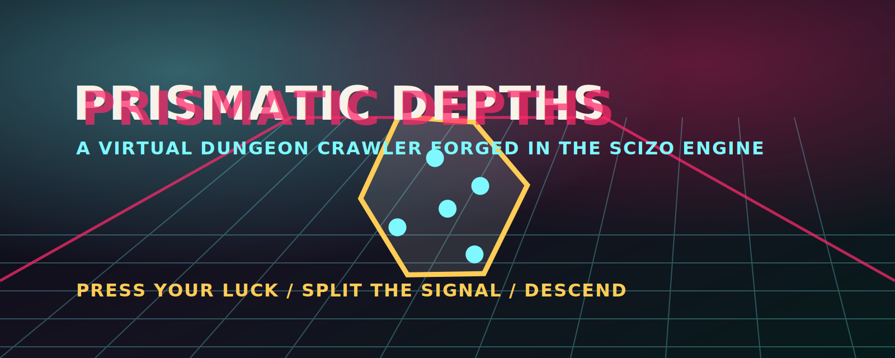
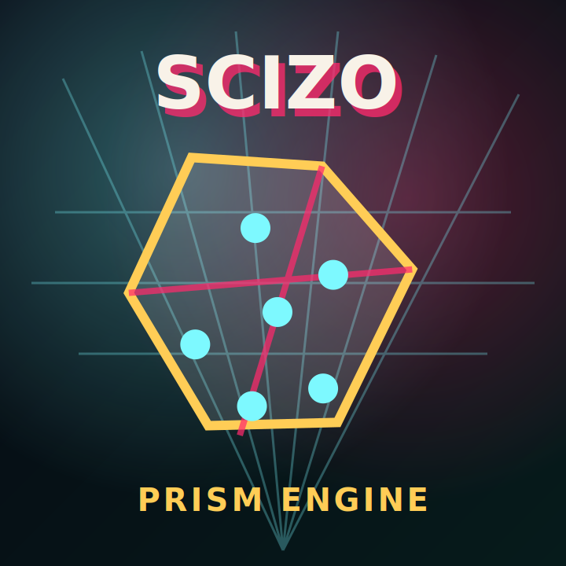

<div align="center">



# PRISMATIC DEPTHS

### A Virtual Dungeon Crawler Forged in the Scizo Engine

**A playable neon-drenched dungeon crawler with PRISM dice mechanics, procedural depths, loot, XP banking, and emergent combat.**  
Solo or party. Press your luck. Split the signal. Descend.

</div>

<div align="center">



</div>

## Features at a Glance

| Feature | Details |
|---|---|
| 4 Hero Classes | Unique abilities and dice pools per class |
| PRISM Dice System | Press mechanic plus combo bonuses for high-risk, high-reward play |
| 13 Monsters | Across 3 tiers with special abilities |
| 8 Room Types | Procedurally generated dungeon layouts |
| 30+ Loot Items | Collectible as playing cards |
| 3 Depths | Scaling difficulty with XP multipliers |
| XP Banking | Bank or risk XP to level up strategically |
| Solo & Party Modes | Play alone or bring a crew |

## Playable Loop

The current build is a compact browser-playable vertical slice:

1. Choose one of four hero classes.
2. Enter a room and roll your hero's PRISM dice pool.
3. Keep the roll or press for a new signal.
4. Resolve damage, guard, focus, combo bonuses, and counterattacks.
5. Claim loot, bank XP, and push deeper through three depths.

## Core Mechanics: The PRISM Dice System

```text
┌─────────────────────────────────────────────┐
│              ROLL PHASE                     │
│   Roll your class dice pool                 │
│        │                                    │
│        ▼                                    │
│   ┌──────────┐     ┌──────────────────┐     │
│   │  KEEP ?  │────►│  PRESS (re-roll) │     │
│   └──────────┘     └───────┬──────────┘     │
│        │                   │                │
│        ▼                   ▼                │
│   ┌──────────┐     ┌──────────────────┐     │
│   │  RESOLVE │     │  COMBO BONUS ?   │     │
│   └──────────┘     └──────────────────┘     │
│        └───────┬───────────┘                │
│                ▼                            │
│        ┌──────────────┐                     │
│        │   OUTCOME    │                     │
│        └──────────────┘                     │
└─────────────────────────────────────────────┘
```

PRISM turns every combat beat into a pressure decision: keep the signal you rolled, or press deeper for a cleaner pattern and risk collapse.

## Monster Tiers

| Tier | Difficulty | Description |
|---|---|---|
| Tier 1 | Common | Early-depth fodder: learn the ropes |
| Tier 2 | Elite | Special abilities that punish reckless play |
| Tier 3 | Boss | Depth guardians with unique mechanics |

## Loot System

- **Weapons** modify your dice pool.
- **Armor** absorbs hits before HP loss.
- **Artifacts** grant passive abilities and combo modifiers.
- **Consumables** create one-shot power spikes.

## Project Structure

```text
Scizo/
 ├── client/               # Frontend UI: neon dungeon terminal
 ├── server/               # Game logic, state management, combat engine
 ├── shared/               # Shared types and constants
 ├── patches/              # Dependency patches
 ├── assets/               # Logos, banners, visuals
 ├── docs/                 # Architecture, roadmap, and system notes
 ├── package.json          # Dependencies and scripts
 ├── vite.config.js        # Build configuration
 ├── .gitignore
 ├── LICENSE
 └── README.md
```

## Getting Started

```bash
git clone https://github.com/noahbenzing1979-boop/Scizo.git
cd Scizo
pnpm install
pnpm dev
```

The current repository includes the first playable browser loop. The next milestone is richer monster behavior, animated dice, more loot cards, and a party mode implementation.

## Development Notes

- Shared PRISM constants live in `shared/game-data.js`.
- The client game lives in `client/` and runs as a lightweight vanilla JS experience.
- The server scaffold lives in `server/` and documents the future combat/state boundary.
- This project is game fiction and not a medical, psychological, or diagnostic tool.

<div align="center">

Built with 🧠 by noahbenzing1979-boop · Part of the InnovativeAI ecosystem

**Press your luck. Split the signal. Descend.**

</div>
