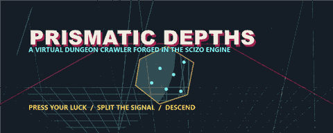

🎲 PRISMATIC DEPTHS
A Virtual Dungeon Crawler Forged in the Scizo Engine
   

⚔️ A neon-drenched dungeon crawler with PRISM dice mechanics, procedural depths, and emergent combat.
Solo or party. Press your luck. Split the signal. Descend.

🔥 Features at a Glance
Feature	Details
4 Hero Classes	Unique abilities and dice pools per class
PRISM Dice System	Press mechanic + Combo bonuses for high-risk, high-reward play
13 Monsters	Across 3 tiers with special abilities
8 Room Types	Procedurally generated dungeon layouts
30+ Loot Items	Collectible as playing cards
3 Depths	Scaling difficulty with XP multipliers
XP Banking	Bank or risk — level up strategically
Solo & Party Modes	Play alone or bring a crew

🧠 Core Mechanics — The PRISM Dice System
Code

Copy
┌─────────────────────────────────────────────┐
│              ROLL PHASE                     │
│   Roll your class dice pool                 │
│        │                                    │
│        ▼                                    │
│   ┌──────────┐     ┌──────────────────┐     │
│   │  KEEP ?  │────►│  PRESS (re-roll) │     │
│   └──────────┘     └───────┬──────────┘     │
│        │                   │                │
│        ▼                   ▼                │
│   ┌──────────┐     ┌──────────────────┐     │
│   │  RESOLVE │     │  COMBO BONUS ?   │     │
│   └──────────┘     └──────────────────┘     │
│        └───────┬───────────┘                │
│                ▼                            │
│        ┌──────────────┐                     │
│        │   OUTCOME    │                     │
│        └──────────────┘                     │
└─────────────────────────────────────────────┘
⚔️ Monster Tiers
Tier	Difficulty	Description
Tier 1	Common	Early-depth fodder — learn the ropes
Tier 2	Elite	Special abilities that punish reckless play
Tier 3	Boss	Depth guardians with unique mechanics

🃏 Loot System
🗡️ Weapons — Modify your dice pool

🛡️ Armor — Absorb hits before HP loss

💎 Artifacts — Passive abilities and combo modifiers

🧪 Consumables — One-shot power spikes

📦 Project Structure
Code

Copy
Scizo/
 ├── client/               # Frontend UI — neon dungeon terminal
 ├── server/               # Game logic, state management, combat engine
 ├── shared/               # Shared types and constants
 ├── patches/              # Dependency patches
 ├── assets/               # Logos, banners, visuals
 ├── components.json       # UI component registry
 ├── package.json          # Dependencies & scripts
 ├── vite.config.ts        # Build configuration
 ├── tsconfig.json         # TypeScript config
 ├── .gitignore
 ├── LICENSE
 └── README.md
🛠️ Getting Started
bash

Copy
git clone https://github.com/noahbenzing1979-boop/Scizo.git
cd Scizo
pnpm install
pnpm dev
Built with 🧠 by noahbenzing1979-boop · Part of the InnovativeAI ecosystem
Press your luck. Split the signal. Descend.
